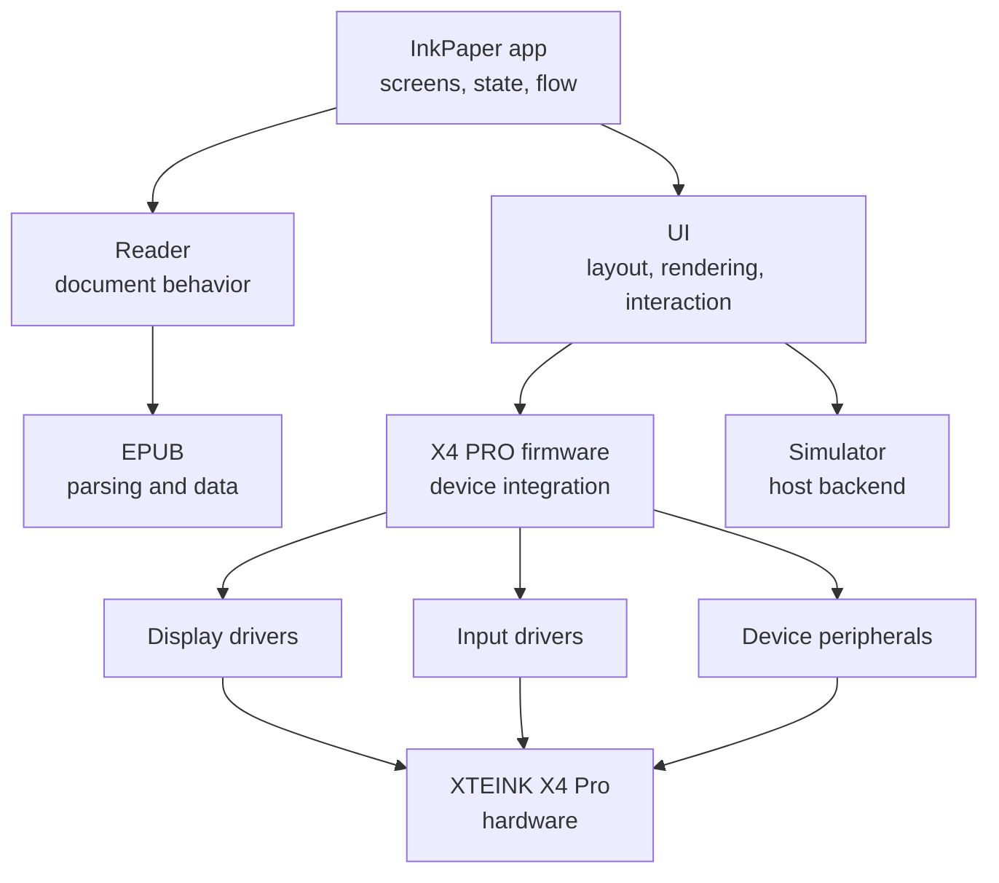
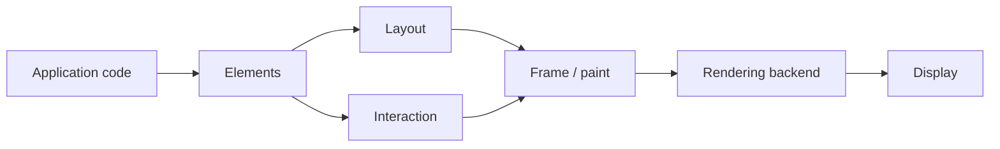

# InkPaper

**Experimental firmware and e-reader stack for the XTEINK X4 PRO**

The project is still taking shape. Its final feature set is not fixed yet. Most of 
the current work is around the firmware architecture, hardware support, document handling,
and the UI stack.

> [!Warning]
> InkPaper is under active development. Use at your own risk.

## Goals

The main goals are:

- keep hardware-specific code separate from application logic
- keep the core firmware compatible with `no_std`
- make device independent code testable on a host machine


## Architecture

InkPaper is split into layers with different responsibilities. 



The diagram shows the rough structure of the project, not every dependency.

## UI Framework

`inkpaper-ui` is a custom UI framework for embedded targets, inspired by 
[gpui](https://github.com/zed-industries/zed/tree/main/crates/gpui). It borrows some of its
ideas around element composition, app state, contexts, and UI construction, adapted to 
`no_std` and memory constrained targets.

The framework is designed to run in `no_std`, and can be used without heap allocation.
Allocation is optional, and can be enabled with the `alloc` feature. 

Application code builds UI trees using higher-level elements, while layout, interaction,
and rendering are handled by the framework:

```rs
impl Render for ReaderView {
  fn render(&mut self, cx: &mut Context<Self>) -> impl IntoElement {
    let theme = cx.global::<Theme>();

    div()
      .w_full()
      .flex()
      .flex_col()
      .bg(theme.background)
      .child(
        text("Header").text_color(theme.foreground),
      )
      .child(
        div()
          .flex()
          .flex_col()
          .child("Paragraph content goes here")
      )
  }
}
```

A simplified view looks like this:



## Development

The firmware and development workflow are still changing.

Until the project is more stable, the repository itself is the source of truth for supported
targets, toolchain configuration, and build commands. 

### Running the simulator

InkPaper uses [`embedded-graphics-simulator`](https://crates.io/crates/embedded-graphics-simulator), follow the installation instructions there.

Then, from the root of the repository, run:

```bash
cargo run -p inkpaper-simulator
```

To open an EPUB:

```bash
cargo run -p inkpaper-simulator -- --epub /path/to/book.epub
```

You can also provide a TTF or OTF font:

```bash
cargo run -p inkpaper-simulator -- \
  --epub /path/to/book.epub \
  --font /path/to/font.ttf
```

### Running on hardware

The X4 PRO firmware targets the ESP32-S3, which requires the Xtensa toolchain. Install [`espup`](https://github.com/esp-rs/espup), then install the toolchain with:

```bash
./setup-toolchain.sh
```

The hardware development and flashing workflow is still evolving. Until it stabilizes, the repository configuration is the source of truth for the exact target, runner, and firmware build settings.

## Contributing

InkPaper is still early and its internal design is changing quickly.

PRs are not open at the moment. Issues and discussions are welcome. 

## License

InkPaper is dual-licensed under either of:

- Apache License, Version 2.0
- MIT License

at your option.